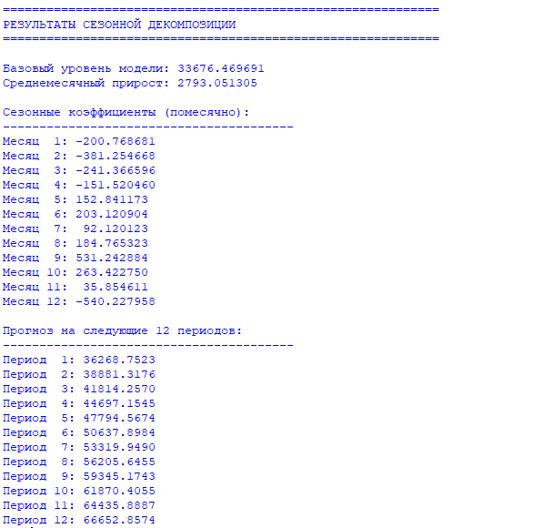

# Анализ и прогнозирование временных рядов с сезонностью методом Хольта–Уинтерса

## Цель работы
Целью данной работы является практическая реализация модели тройного экспоненциального сглаживания (Хольта–Уинтерса) для анализа, сезонной декомпозиции и прогнозирования временных рядов с ярко выраженными трендом и сезонностью на основе реальных статистических данных.

## Постановка задачи
В рамках работы необходимо:
1.  Реализовать класс для загрузки и обработки временных рядов из CSV-файла.
2.  Разработать алгоритм тройного экспоненциального сглаживания Хольта–Уинтерса с аддитивной сезонностью.
3.  Определить и рассчитать ключевые параметры модели: базовый уровень (L), трендовую компоненту (T) и сезонные коэффициенты (S).
4.  Реализовать функцию генерации прогноза на заданное количество периодов вперед.
5.  Применить модель к реальным данным, проанализировать и визуализировать полученные результаты.

## Краткое описание модели
Модель Хольта–Уинтерса (Holt-Winters) — это метод тройного экспоненциального сглаживания, предназначенный для прогнозирования временных рядов, содержащих тренд и сезонность. Модель оперирует тремя компонентами:
*   **Уровень (Level, L)**: сглаженное среднее значение ряда, отражающее базовый уровень процесса.
*   **Тренд (Trend, T)**: линейная компонента, описывающая систематическое увеличение или уменьшение значений ряда со временем.
*   **Сезонность (Seasonality, S)**: набор коэффициентов, моделирующих периодические колебания фиксированной длины (например, 12 месяцев).

В данной работе используется **аддитивная модель**, которая предполагает, что амплитуда сезонных колебаний не зависит от текущего уровня ряда, а является постоянной добавкой.

### Математическая модель (Аддитивная сезонность)

**Обозначения:**
*   `y_t` — фактическое значение временного ряда в момент времени `t`.
*   `L_t` — оценка уровня ряда в момент `t`.
*   `T_t` — оценка тренда в момент `t`.
*   `S_t` — оценка сезонного компонента для периода `t`.
*   `m` — длина полного сезонного цикла (в нашем случае `m = 12` месяцев).
*   `α` (alpha), `β` (beta), `γ` (gamma) — коэффициенты экспоненциального сглаживания для уровня, тренда и сезонности соответственно, где `0 < α, β, γ < 1`.

**Рекуррентные уравнения модели (обновление параметров для каждого нового наблюдения):**
1.  **Обновление уровня:** `L_t = α * (y_t - S_{t-m}) + (1-α) * (L_{t-1} + T_{t-1})`
2.  **Обновление тренда:** `T_t = β * (L_t - L_{t-1}) + (1-β) * T_{t-1}`
3.  **Обновление сезонности:** `S_t = γ * (y_t - L_t) + (1-γ) * S_{t-m}`

**Формула прогноза на `h` шагов вперед из текущего момента `t`:**
`ŷ_{t+h} = L_t + h * T_t + S_{t+h-m}`

## Исходный код программы
Полная реализация модели, включая загрузку данных, инициализацию параметров, обучение модели и генерацию прогноза, находится в файле:
**[IMMOD.py](./IMMOD.py)**

Основные классы и функции:
*   `TimeSeriesAnalyzer`: основной класс-анализатор.
*   `load_series_from_file()`: загрузка данных из CSV.
*   `compute_linear_approximation()`: инициализация уровня и тренда через линейную регрессию.
*   `seasonal_decomposition()`: ядро алгоритма Хольта-Уинтерса, выполняющее тройное сглаживание.
*   `generate_predictions()`: генерация прогноза на будущие периоды.
*   `execute_forecasting_pipeline()`: управляющая функция, запускающая полный цикл анализа.

## Результаты работы программы
Программа была применена к временному ряду, содержащему 24 наблюдения (2 полных годовых цикла) с явно выраженным возрастающим трендом и месячной сезонностью (`m=12`).

### Параметры модели Хольта–Уинтерса
*   **Базовый уровень (L):** 33676.469691
*   **Среднемесячный прирост (тренд T):** 2793.051305 (сильный положительный тренд)
*   **Коэффициенты сглаживания:** α = 0.4000, β = 0.3000, γ = 0.3000

### Сезонные коэффициенты (S)
В таблице ниже показаны сезонные поправки для каждого месяца. Положительное значение означает, что в этот месяц значение ряда, как правило, *выше* уровня, предсказанного трендом, отрицательное — *ниже*.

| Месяц | Сезонный коэффициент | Интерпретация |
| :--- | :--- | :--- |
| 1 | -200.77 | Ниже тренда |
| 2 | -381.25 | Значительно ниже тренда |
| 3 | -241.37 | Ниже тренда |
| 4 | -151.52 | Ниже тренда |
| 5 | +152.84 | Выше тренда |
| 6 | +203.12 | Выше тренда |
| 7 | +92.12 | Незначительно выше тренда |
| 8 | +184.77 | Выше тренда |
| **9** | **+531.24** | **Наиболее выраженный положительный эффект** |
| 10 | +263.42 | Выше тренда |
| 11 | +35.85 | Незначительно выше тренда |
| **12** | **-540.23** | **Наиболее выраженный отрицательный эффект** |

### Прогноз на 12 периодов вперед
| Период | Прогнозное значение (ŷ) |
| :--- | :--- |
| 1 | 36268.7523 |
| 2 | 38881.3176 |
| 3 | 41814.2570 |
| 4 | 44697.1545 |
| 5 | 47794.5674 |
| 6 | 50637.8984 |
| 7 | 53319.9490 |
| 8 | 56205.6455 |
| 9 | 59345.1743 |
| 10 | 61870.4055 |
| 11 | 64435.8887 |
| 12 | 66652.8574 |

**Анализ прогноза:** Прогноз демонстрирует устойчивый рост, обусловленный сильным положительным трендом (~2793 единиц в месяц). Сезонные коэффициенты накладываются на этот тренд, создавая характерные "волны": прогнозируемые снижения в начале года (периоды 1-4, особенно период 2) и в конце (период 12), а также пики в середине и конце года (периоды 5-6 и особенно период 9).

## Экраны работы программы

*Рисунок: Вывод программы с итоговыми параметрами модели, сезонными коэффициентами и прогнозом на 12 периодов.*

## Вывод
В ходе работы была успешно реализована и применена модель тройного экспоненциального сглаживания Хольта–Уинтерса. Анализ временного ряда позволил выявить:
1.  **Сильный положительный линейный тренд**, что является основной движущей силой роста значений ряда.
2.  **Четко выраженную 12-месячную сезонность**. Модель количественно оценила сезонные отклонения, выделив наиболее "слабые" месяцы (февраль и декабрь) и наиболее "сильные" (сентябрь).
3.  Сгенерированный **прогноз на следующий год** является экстраполяцией выявленных закономерностей: общий восходящий тренд продолжается, а сезонная картина повторяется.

Модель Хольта-Уинтерса доказала свою эффективность для декомпозиции и краткосрочного прогнозирования рядов с трендом и сезонностью. Реализация является модульной и может быть легко адаптирована для работы с другими рядами, параметрами сглаживания и длинами сезонного цикла.

## Вывод
Модель Хольта–Уинтерса позволяет эффективно прогнозировать временные ряды с учётом уровня, тренда и сезонности. Результаты прогноза могут использоваться для планирования и анализа динамики показателей.

---
