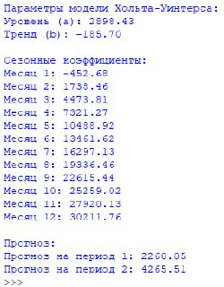

# Прогнозирование временных рядов ( Объёма погрузки грузов на водном транспорте) методом Хольта–Уинтерса

## Цель работы
Цель данного проекта — построение прогноза временного ряда с использованием модели Хольта–Уинтерса.  
Модель позволяет учитывать три компонента: уровень, тренд и сезонность, что особенно полезно для анализа данных с сезонными колебаниями (например, ежемесячные показатели продаж, температуры или других показателей).

## Постановка задачи
- Загрузить данные из CSV-файла.
- Построить модель Хольта–Уинтерса с сезонной составляющей.
- Получить прогноз на следующие периоды.
- Вывести параметры модели (уровень, тренд, сезонные коэффициенты) и прогнозные значения.

## Краткое описание модели
Модель Хольта–Уинтерса включает три основных параметра:

- Уровень (Level, a) — базовый уровень ряда.
- Тренд (Trend, b) — направление изменения ряда (рост или падение).
- Сезонные коэффициенты (Seasonals, s) — сезонная составляющая, учитывающая циклические колебания.

Модель обновляет эти параметры на каждом шаге с использованием сглаживающих коэффициентов:

- α (alpha1) — сглаживание уровня.
- β (alpha2) — сглаживание тренда.
- γ (alpha3) — сглаживание сезонности.

Прогноз на следующие периоды рассчитывается как сумма уровня, тренда и сезонного компонента.

## Исходный код программы

👉 ❗️ **[Код программы](./IMMOD)**

## Результаты работы

### Параметры модели

| Параметр       | Значение      |
|----------------|---------------|
| Уровень (a)    | 33676.47      |
| Тренд (b)      | 2793.05       |

### Сезонные коэффициенты

| Месяц | Коэффициент |
|-------|------------|
| 1     | -200.77    |
| 2     | -381.25    |
| 3     | -241.37    |
| 4     | -151.52    |
| 5     | 152.84     |
| 6     | 13461.62   |
| 7     | 16297.13   |
| 8     | 19336.46   |
| 9     | 22615.44   |
| 10    | 25259.02   |
| 11    | 27920.13   |
| 12    | 30211.76   |

### Прогноз на следующие периоды

| Период | Прогноз |
|--------|---------|
| 1      | 2260.05 |
| 2      | 4265.51 |

## Скриншоты работы программы
  

## Вывод
Модель Хольта–Уинтерса позволяет эффективно прогнозировать временные ряды с учётом уровня, тренда и сезонности. Результаты прогноза могут использоваться для планирования и анализа динамики показателей.

---
